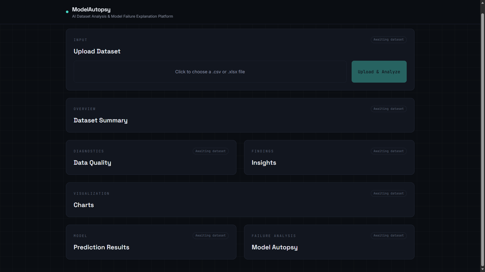
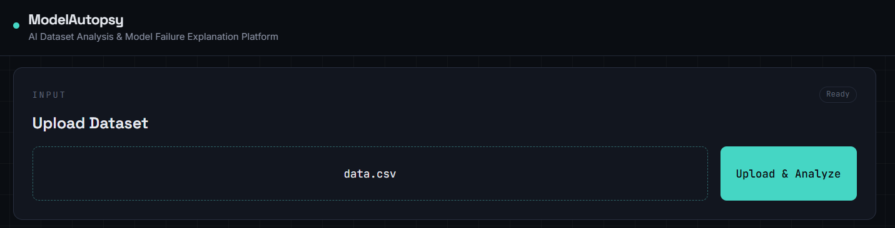
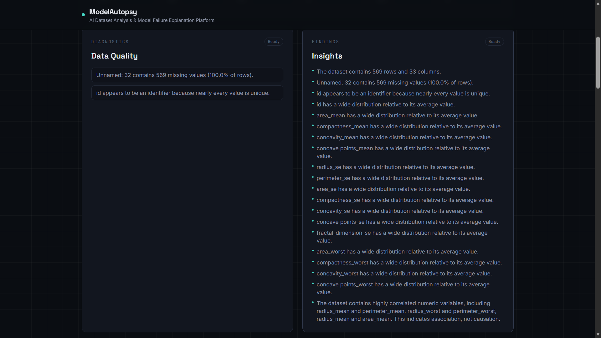
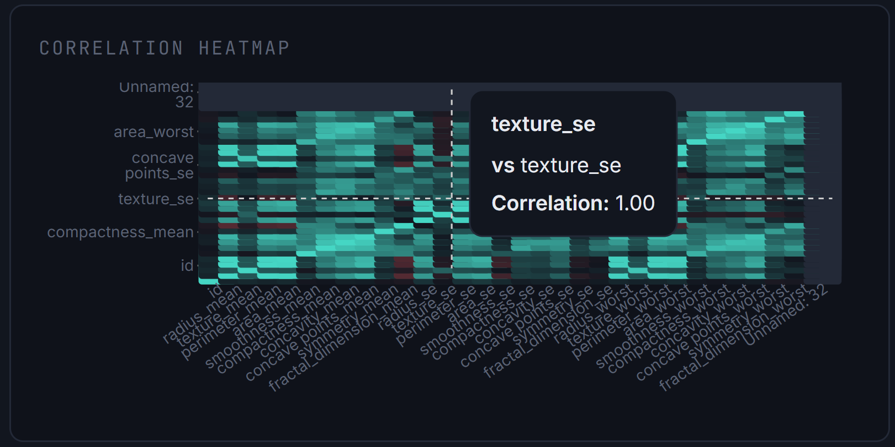
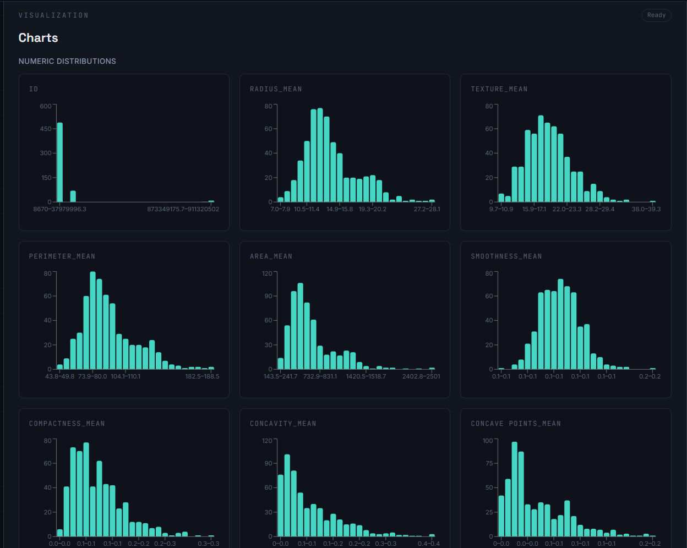
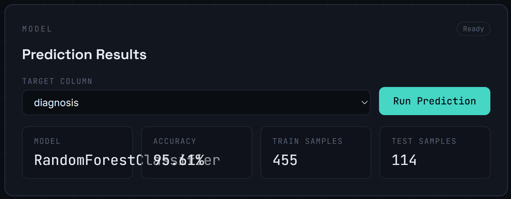
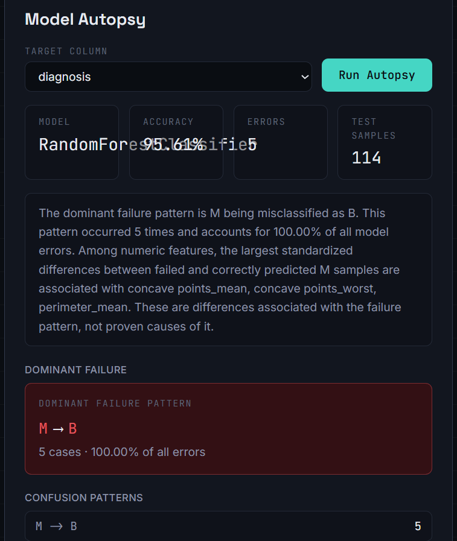

# 🧠 ModelAutopsy

An end-to-end Machine Learning Analysis and Prediction Platform built with **FastAPI**, **React**, **TypeScript**, and **Scikit-learn**.

ModelAutopsy enables users to upload datasets, analyze data quality, train machine learning models, generate predictions, and understand model performance through interactive visualizations—all from a modern web interface.

---

## ✨ Features

- 📂 Upload CSV datasets
- 📊 Automatic dataset analysis
- 🧹 Missing value detection
- 📈 Statistical summaries
- 🔥 Correlation heatmap
- 📉 Distribution visualizations
- 🤖 Machine learning model training
- 🎯 Predictions on new data
- 📋 Model evaluation metrics
- 🌟 Feature importance visualization
- ⚡ FastAPI backend with React frontend

---

## 🛠️ Tech Stack

### Frontend
- React
- TypeScript
- Vite
- Tailwind CSS
- Recharts

### Backend
- FastAPI
- Uvicorn

### Machine Learning
- Scikit-learn
- Pandas
- NumPy

### Data Visualization
- Matplotlib
- Seaborn

### Development Tools
- Python
- Git & GitHub
- VS Code

---

## 📂 Project Structure

```text
ModelAutopsy/
├── backend/              # FastAPI backend
├── frontend/             # React + TypeScript frontend
├── src/                  # Machine Learning engine
├── data/                 # Sample datasets
├── reports/              # Generated analysis reports
├── .gitignore
├── main.py
└── README.md
```

---

## 🚀 Installation

### Clone the repository

```bash
git clone https://github.com/hemanthsom07-sketch/ModelAutopsy.git
cd ModelAutopsy
```

### Backend Setup

```bash
cd backend
pip install -r requirements.txt
python main.py
```

### Frontend Setup

```bash
cd frontend
npm install
npm run dev
```

The application will be available at:

- Frontend: http://localhost:5173
- Backend: http://localhost:8000

---

# 📸 Application Screenshots

## 🏠 Home Page



---

## 📂 Upload Dataset



---

## 📊 Dataset Analysis



---

## 🔥 Correlation Heatmap



---

## 📈 Distribution Analysis



---

## 🎯 Prediction Results



---

## 🧠 Model Autopsy

